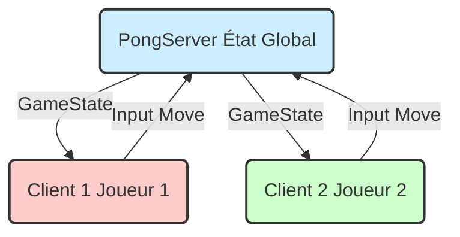
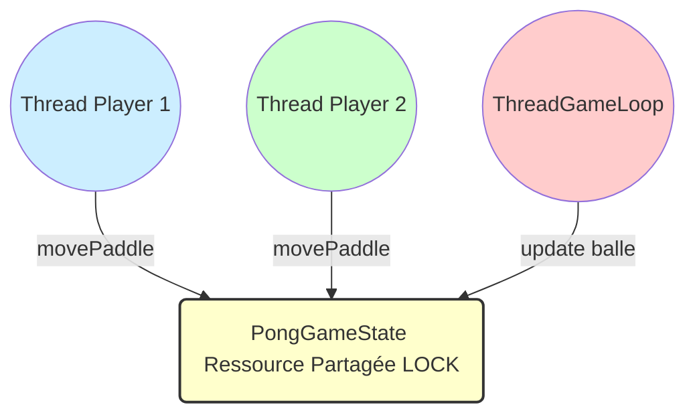

# Projet de Programmation Concurrente et Distribuée
**Distribution d'un jeu Pong en Java**

Faculté des Sciences de Bizerte  
Cycle ingénieur - Première année  

**Auteurs :**
* Firas Baklouti
* Brahim Abid
* Taher Guedda

---

## Introduction
Dans le cadre du cours de Programmation Concurrente et Distribuée, nous avons réalisé la distribution d'un jeu vidéo classique : le **Pong**. L'objectif principal de ce projet est de transformer une application locale monojoueur en une application distribuée multijoueur (client-serveur), en mettant en pratique les concepts fondamentaux du cours tels que les sockets, les threads, et la synchronisation.

## Architecture de la Solution

### Modèle Client-Serveur
Nous avons opté pour une architecture **Client-Serveur Centralisée** (Server-Authoritative).

* **Le Serveur (PongServer)** : Il est la source unique de vérité. Il maintient l'état global du jeu (`PongGameState`), calcule la physique (mouvement de la balle, collisions), et gère les scores. Il diffuse l'état du jeu mis à jour à tous les clients.
* **Les Clients (PongClient)** : Ils sont de simples terminaux d'affichage et d'entrée. Ils envoient les commandes utilisateur (Haut/Bas) au serveur et affichent l'état du jeu reçu. Ils ne calculent pas la physique pour éviter les désynchronisations (triche).

#### Schéma de l'Architecture (Client-Serveur)



### Justification des Choix Techniques

#### Protocole de Transport : TCP
Nous avons choisi le protocole **TCP** (via `java.net.Socket`) pour la communication.
* **Justification** : Bien que UDP soit souvent utilisé pour les jeux rapides pour réduire la latence, TCP garantit qu'aucun paquet (commande de mouvement ou état critique du jeu) n'est perdu. Dans le contexte de ce projet académique, la fiabilité et la cohérence de l'état (pas de "téléportation" de raquettes due à des paquets perdus) ont été privilégiées par rapport à la latence pure.
* **Lien cours** : *"2-CI1-CS_Sockets.pdf"* - Utilisation de `ServerSocket` et `Socket` pour établir une connexion fiable.

#### Sérialisation Java
L'échange de données se fait via la sérialisation native Java (`Serializable`).
* **Justification** : Cela simplifie grandement l'encodage et le décodage des objets complexes comme `PongGameState`. Le serveur envoie directement l'objet, et le client le reçoit tel quel.

## Implémentation et Concepts du Cours

Cette section détaille comment nous avons résolu les problèmes liés à la distribution et à la concurrence, en lien direct avec les supports de cours.

### Programmation Concurrente (Threads)
Le serveur doit gérer plusieurs tâches simultanément : accepter les connexions, écouter les inputs de chaque joueur, et faire tourner la boucle de jeu principale.

* **Solution** : Utilisation du modèle *"Un thread par client"*.
* **Détail** : La classe `PongServer` possède une classe interne `PlayerHandler` qui hérite de `Thread`. Chaque instance de `PlayerHandler` écoute en boucle les commandes d'un joueur spécifique.
* **Lien cours** : *"3-CI1-Prog_Concurrente_Java.pdf"* (Slide 8/125). Nous appliquons le modèle où main thread gère le `accept()` et délègue le traitement à des worker threads.

```java
// Dans PongServer.java
players[0] = new PlayerHandler(s1, 1);
players[0].start(); // Démarre le thread d'écoute pour J1

// Classe interne
private class PlayerHandler extends Thread {
    public void run() {
        while (connected && running) {
            int direction = in.readInt(); // Bloquant !
            gameState.movePaddle(playerId, direction);
        }
    }
}
```

### Synchronisation et Thread Safety
Plusieurs threads accèdent simultanément à l'objet partagé `gameState` :
1. Le thread principal (`gameLoop`) met à jour la position de la balle.
2. Les threads `PlayerHandler` mettent à jour la position des raquettes.

* **Problème** : *Race Condition*. Si le serveur met à jour la physique pendant qu'un joueur déplace sa raquette, l'état peut devenir incohérent (ex: la balle traverse la raquette).
* **Solution** : Utilisation de `ReentrantLock` pour protéger la méthode `update()`.
* **Lien cours** : *"4-CI1-Synchronisation_Java.pdf"* (Slide 15). Utilisation de verrous explicites (`Lock`) pour une gestion fine de la section critique.

#### Schéma d'Accès Concurrent et Verrouillage



Nous avons également utilisé `AtomicInteger` pour les scores afin de garantir l'atomicité des incrémentations sans verrouillage lourd (cf. Slide 34 du cours Synchronisation).

## Validation et Tests

Nous avons validé notre solution selon le scénario suivant, conforme aux exigences :

1. **Démarrage Serveur** : `Waiting for players...` s'affiche.
2. **Connexion J1** : Le serveur détecte la connexion, assigne l'ID 1. Le client affiche "Attente du J2".
3. **Connexion J2** : Le serveur détecte J2, assigne l'ID 2.
4. **Jeu** : Le serveur lance la `gameLoop`. La balle bouge sur les deux écrans de manière synchronisée.
5. **Interaction** : Les touches (Haut/Bas) déplacent les raquettes correctement et les collisions sont gérées par le serveur.

## Conclusion
Ce projet nous a permis de mettre en œuvre une architecture distribuée complète. Nous avons dû faire face aux défis de la synchronisation (accès concurrent à l'état du jeu) et de la communication réseau. Notre choix d'une architecture autoritaire avec TCP assure la fiabilité nécessaire pour respecter les règles du jeu, en adéquation avec les concepts enseignés.
